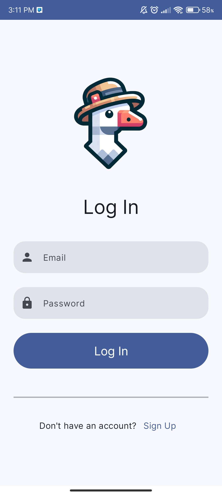
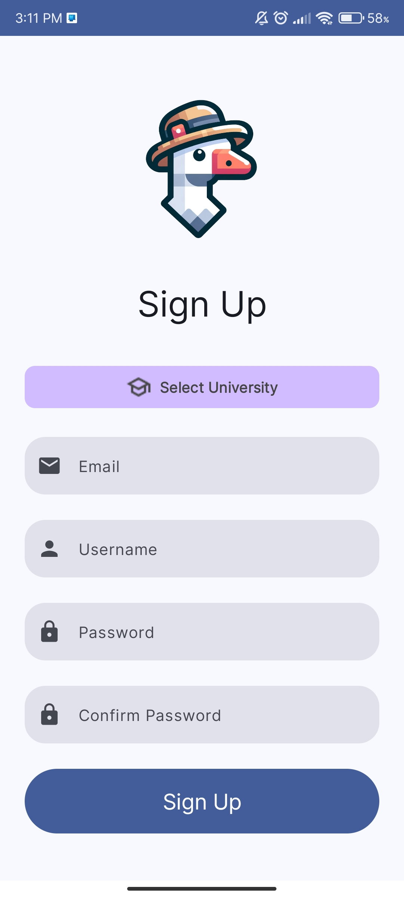
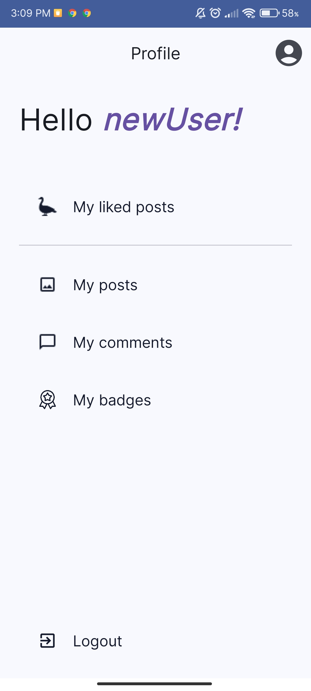
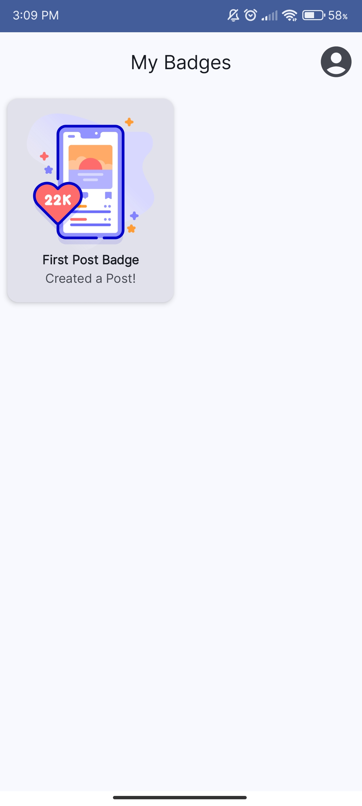
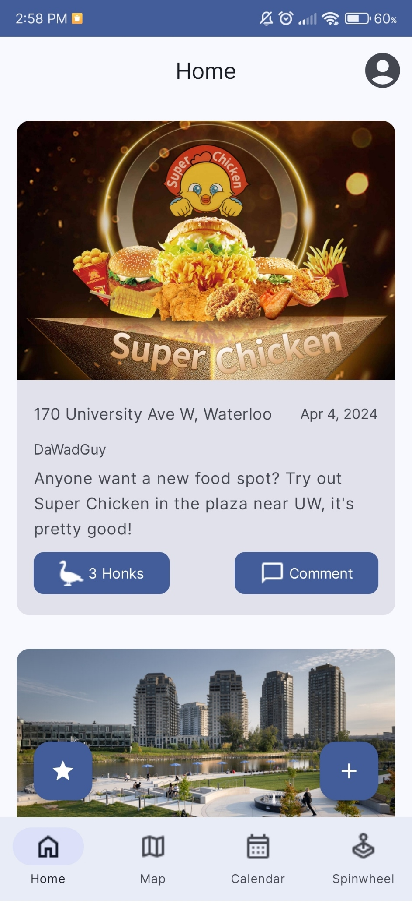
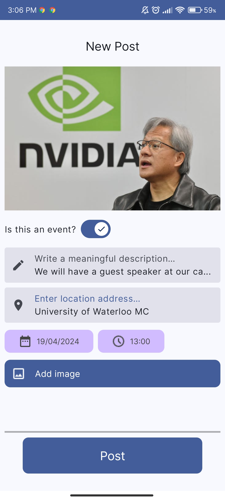
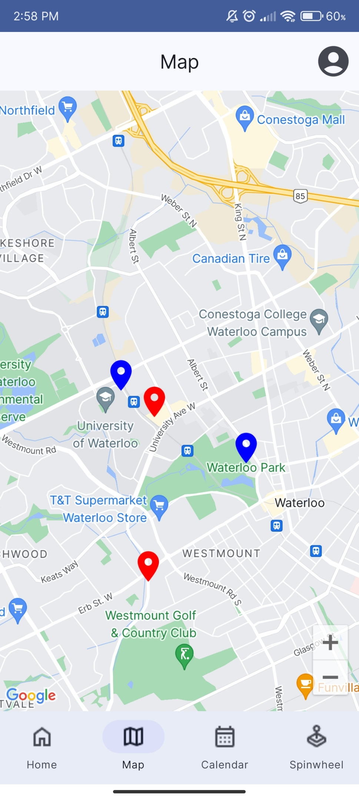
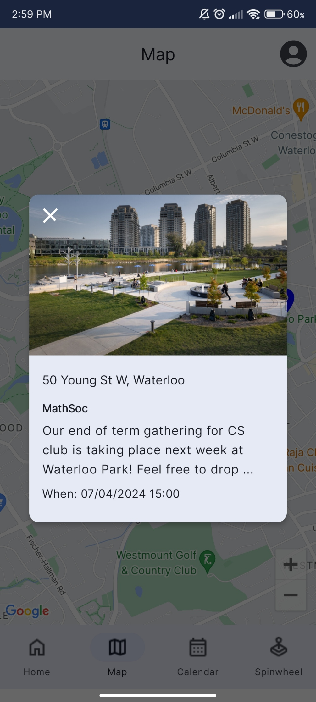
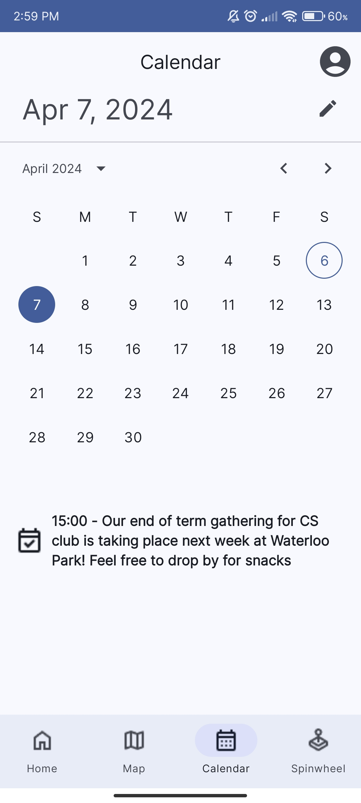
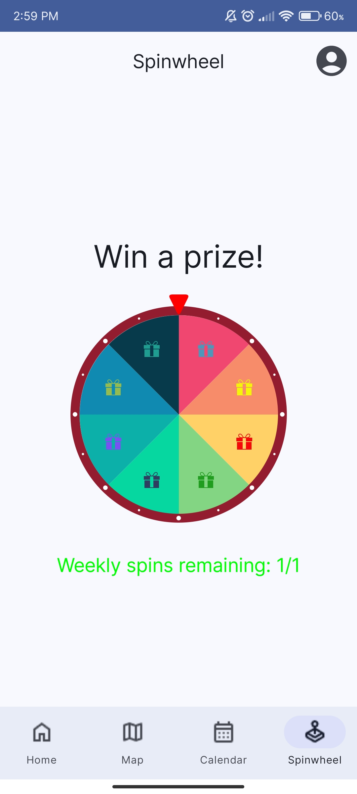

# Univibe

## Project Description

Univibe is a campus exploration app that helps students share and discover interesting places around campus. Users can create their own profiles and post about unique places or events around their university, and earn awards based on their activity on the app!

### Built With

* [![Android][Android]][Android-url]
* [![Kotlin][Kotlin]][Kotlin-url]
* [![Firebase][Firebase]][Firebase-url]
* [![GCP][GCP]][GCP-url]

## Installation
Download the app from the Google Play Store!
[Google Play Store Page](https://play.google.com/store/apps/details?id=com.team10210.univibe)

## Feature Guidelines

Welcome to Univibe, the ultimate social platform tailored for university students! Dive into our array of features designed to enhance your campus experience, connect you with peers, and celebrate your achievements. Here's how to make the most out of Univibe:

### Getting Started

- Log In / Sign Up: Begin by logging into your existing account or signing up for a new one, selecting your university in the process. This customization ensures that you're connected with posts and events from fellow peers at your campus.

Screenshots

### First Steps

- Onboarding Screen: Just signed up? Enjoy a warm welcome through our onboarding screen, which outlines Univibe's purpose and how you can benefit from joining our community.

### View Your Profile

- Profile Page: Tap the icon button on the top right to access your profile. Here, you can manage your account, including logging out, viewing your posts, comments, and honked posts (our fun term for likes), as well as checking out the badges you've earned.

- Badges: Engage with our app by creating posts, commenting, and more to earn badges. Keep exploring Univibe to discover and collect them all!

Screenshots

### Discover and Create

- Homepage: Get right into the action! Browse through posts from fellow university students. Show your support by honking posts, dive deeper into conversations by viewing and adding comments, or be delighted by a surprise post selected randomly through the floating button on the bottom left. Ready to share? Tap the bottom right button to create a new post. Created something you wish to remove? Simply navigate to your post's details and hit the red delete button.

Screenshots

### Special Features

- New Post: Share your moments by adding a description, photograph, and location address. Hosting an event? Mark your post as an event and set the date and time to notify your campus community.

- Map: Visualize where the buzz is with pins on the map for each post. Zoom in to see individual pins and tap them to uncover more about the posts and their locations. Click on the info card that appears after selecting a pin to return to the full post.

- Calendar: Keep track of campus events easily. Select any date on the calendar to see what's happening or what's upcoming.

- Spinwheel: Don’t miss out on your chance to win weekly prizes exclusive to your university. Visit the spinwheel feature weekly to spin for new rewards.

Screenshots

### Univibe is here to make your university experience unforgettable. Start exploring, connecting, and enjoying everything our app has to offer!**

## Team members

Sowad Khan, <s549khan@uwaterloo.ca>
Bahaa Desoky, <b2desoky@uwaterloo.ca>
Omer Faruk, <ofyildir@uwaterloo.ca>
Ali Faez, <afaez@uwaterloo.ca>

<!-- MARKDOWN LINKS & IMAGES -->
<!-- https://www.markdownguide.org/basic-syntax/#reference-style-links -->
[Kotlin]: https://img.shields.io/badge/Kotlin-purple?style=for-the-badge&logo=kotlin
[Kotlin-url]: https://kotlinlang.org/
[Android]: https://img.shields.io/badge/Android-green?style=for-the-badge&logo=android
[Android-url]: https://developer.android.com/
[Firebase]: https://img.shields.io/badge/Firebase-orange?style=for-the-badge&logo=firebase
[Firebase-url]: https://firebase.google.com/
[GCP]: https://img.shields.io/badge/GCP-white?style=for-the-badge&logo=google-cloud
[GCP-url]: https://cloud.google.com/?hl=en
